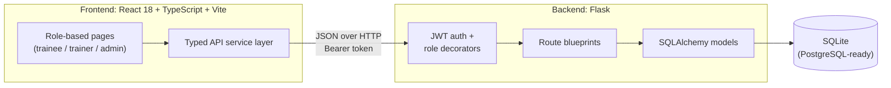
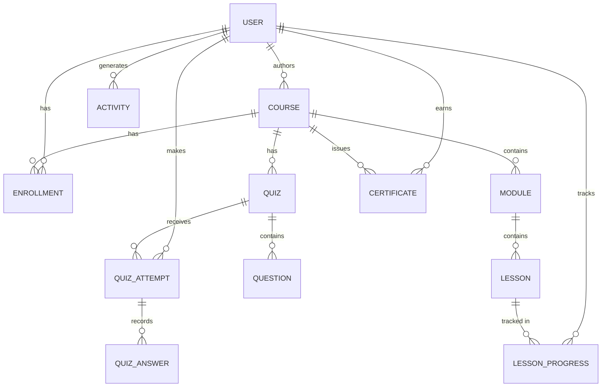

<div align="center">

# Prayas

**A role-based learning platform for trainees, trainers and administrators.**

Discover courses, learn through structured lessons, get assessed with timed quizzes, earn certificates, and track progress, all in one place.


[Features](#features) · [Architecture](#architecture) · [Quick Start](#quick-start) · [API](#api-reference) · [Data Model](#data-model) · [Roadmap](#roadmap)

</div>

---

## Overview

Prayas connects three kinds of users around a single training workflow:

| Role | What they do |
| --- | --- |
| **Trainee** | Browse and enrol in courses, work through lessons, take quizzes, earn certificates |
| **Trainer** | Author courses, monitor enrolled students, spot learners who are falling behind |
| **Admin** | Manage users, moderate courses, view platform-wide analytics |

The backend is a Flask REST API secured with JWT and role-based access control. The frontend is a React + TypeScript single-page app with a dedicated experience for each role.

## Features

### For trainees
- **Course catalog** with search and filters by category and difficulty
- **Course detail** pages showing modules, lessons and quizzes before enrolling
- **Lesson reader** with sidebar navigation and live progress
- **Timed quizzes** with instant scoring and pass/fail results
- **Progress dashboard** with per-course completion and quiz history
- **Printable certificates** with a unique certificate ID

### For trainers
- **Course authoring** with modules, lessons and quiz questions (full create/edit/delete)
- **Student tracking** with progress and quiz scores per enrolled learner
- **Analytics** covering enrolments, completion rates and course performance
- **Needs Attention** view that automatically flags students with low progress or scores

### For admins
- **Dashboard** with platform statistics and a recent activity feed
- **User management**: search, filter, change roles, activate or deactivate accounts
- **Course moderation**: publish or unpublish any course
- **Analytics**: category distribution, top courses, enrolment timeline, role breakdown
- **Platform settings**

## Architecture



Requests flow through a typed service layer to the API. Each route validates the JWT and checks the caller's role before touching the database, so access rules are enforced on the server and not just hidden in the UI.

### Tech stack

| Layer | Technology |
| --- | --- |
| Frontend | React 18, TypeScript, Vite, Tailwind CSS, React Router v6, Recharts, Lucide React |
| Backend | Python 3, Flask, Flask-SQLAlchemy |
| Database | SQLite, structured for a straightforward move to PostgreSQL |
| Auth | PyJWT, Werkzeug password hashing |
| Tooling | Docker |

## Quick Start

**Prerequisites:** Python 3.10+, Node.js 18+, npm 9+

```bash
git clone https://github.com/rohitkumawat-dev/Prayas.git
cd Prayas
```

### 1. Backend

```bash
cd backend
python -m venv venv
source venv/bin/activate        # Windows: venv\Scripts\activate
pip install -r requirements.txt

python seed.py                  # load demo data
python run.py                   # http://localhost:5000
```

### 2. Frontend

In a second terminal:

```bash
cd frontend
npm install
npm run dev                     # http://localhost:5173
```

To create a production build: `npm run build`.

### Demo accounts

`seed.py` creates the accounts below. They are intended for local development only.

| Role | Email | Password |
| --- | --- | --- |
| Admin | `admin@capacityconnect.com` | `Admin@123` |
| Trainer | `ananya.iyer@example.com` | `Trainer@123` |
| Trainee | `arjun.nair@example.com` | `Trainee@123` |

More trainer and trainee accounts (`rohan.mehta`, `priya.sharma`, `kavya.reddy`, `raj.patel`, `neha.gupta`, `vikram.singh` at `@example.com`) share the same role passwords.

## Project Structure

```
Prayas/
├── backend/
│   ├── app/
│   │   ├── __init__.py       # Flask app factory
│   │   ├── models/           # SQLAlchemy models (12)
│   │   ├── routes/           # API blueprints (10)
│   │   └── utils/            # Decorators and helpers
│   ├── config.py
│   ├── run.py                # Entry point
│   ├── seed.py               # Demo data
│   └── requirements.txt
├── frontend/
│   ├── src/
│   │   ├── components/       # UI and shared components
│   │   ├── contexts/         # Auth and toast providers
│   │   ├── hooks/            # Custom hooks
│   │   ├── pages/            # Route pages: trainee, trainer, admin
│   │   ├── services/         # API service modules
│   │   ├── types/            # TypeScript interfaces
│   │   └── utils/
│   ├── package.json
│   └── vite.config.ts
├── Dockerfile
└── README.md
```

## API Reference

Base URL: `http://localhost:5000/api`. Protected routes expect `Authorization: Bearer <token>`.

<details>
<summary><b>Auth</b></summary>

| Method | Endpoint | Description |
| --- | --- | --- |
| `POST` | `/auth/register` | Register a trainee or trainer |
| `POST` | `/auth/login` | Log in and receive a JWT |
| `GET` | `/auth/me` | Current user |

</details>

<details>
<summary><b>Courses, lessons and quizzes</b></summary>

| Method | Endpoint | Description |
| --- | --- | --- |
| `GET` | `/courses` | List published courses (search and filter) |
| `GET` | `/courses/:id` | Course detail with modules |
| `POST` | `/courses/:id/enroll` | Enrol in a course |
| `GET` | `/lessons/:id` | Lesson with navigation context |
| `POST` | `/lessons/:id/complete` | Mark a lesson complete |
| `GET` | `/quizzes/:id` | Quiz with questions |
| `POST` | `/quizzes/:id/submit` | Submit answers and get a score |

</details>

<details>
<summary><b>Progress and certificates</b></summary>

| Method | Endpoint | Description |
| --- | --- | --- |
| `GET` | `/progress` | All enrolled courses with progress |
| `GET` | `/progress/dashboard` | Trainee dashboard data |
| `GET` | `/progress/courses/:id` | Detailed progress for one course |
| `GET` | `/certificates` | The user's certificates |
| `POST` | `/certificates/claim/:courseId` | Claim a certificate |

</details>

<details>
<summary><b>Trainer (trainer role)</b></summary>

| Method | Endpoint | Description |
| --- | --- | --- |
| `GET` `POST` | `/trainer/courses` | List and create courses |
| `POST` | `/trainer/courses/:id/modules` | Add a module |
| `POST` | `/trainer/modules/:id/lessons` | Add a lesson |
| `POST` | `/trainer/courses/:id/quizzes` | Add a quiz |
| `GET` | `/trainer/students` | Enrolled students with progress |
| `GET` | `/trainer/analytics` | Course analytics |
| `GET` | `/trainer/needs-attention` | At-risk students |

</details>

<details>
<summary><b>Admin (admin role)</b></summary>

| Method | Endpoint | Description |
| --- | --- | --- |
| `GET` | `/admin/dashboard` | Platform statistics |
| `GET` `PUT` `DELETE` | `/admin/users` | Manage users |
| `GET` | `/admin/trainees` | Trainee details with progress |
| `GET` | `/admin/trainers` | Trainer details with course counts |
| `GET` | `/admin/analytics` | Platform analytics |
| `GET` `PUT` | `/admin/settings` | Platform settings |

</details>

## Data Model



Twelve models: `User`, `Course`, `Module`, `Lesson`, `Enrollment`, `Quiz`, `Question`, `QuizAttempt`, `QuizAnswer`, `LessonProgress`, `Certificate`, `Activity`.

## Security

- Stateless JWT authentication
- Passwords hashed with Werkzeug, never stored in plain text
- Role checks enforced server-side via route decorators
- Public registration limited to trainee and trainer roles
- Admins can deactivate accounts without deleting data

## Frontend Notes

- **Design system:** dark slate theme with violet (`#8b5cf6`) and cyan (`#06b6d4`) accents, plus a shared component set (Button, Input, Select, Badge, Table, Dialog, Tabs, ProgressBar, Alert, Toast, Skeleton, EmptyState, ErrorState)
- **Performance:** every page is lazy-loaded with `React.lazy`, and `react`, `recharts` and `lucide-react` are split into separate vendor chunks
- **SEO:** per-route titles, meta descriptions and canonical tags via a small `useSEO()` hook; Open Graph and Twitter tags; `Organization`, `Course` and `BreadcrumbList` JSON-LD; `robots.txt`, `sitemap.xml` and `llms.txt`, with authenticated routes marked `noindex`
- **Before deploying:** update `SITE_URL` in `frontend/src/hooks/use-seo.ts` and the domain in `index.html`, `sitemap.xml` and `robots.txt`

## Roadmap

- [ ] PostgreSQL support for production deployments
- [ ] Human-readable course URLs (`/courses/react-basics`)
- [ ] Automated tests and a CI pipeline
- [ ] Video and document lesson types
- [ ] Certificate verification via QR code
- [ ] Multilingual content

## Contributing

1. Fork the repository and create a branch: `git checkout -b feature/your-feature`
2. Make your changes and commit with a clear message
3. Push the branch and open a pull request describing what changed and why

## Author

**Rohit Kumawat** · [@rohitkumawat-dev](https://github.com/rohitkumawat-dev)
